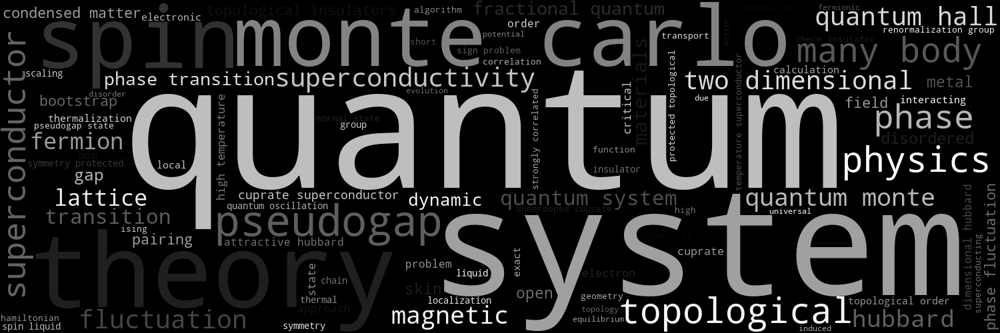

<h1 id="about-me"></h1>

## About Me

  

I am currently a PhD student, major in *condensed matter theory*, at the Department of Physics, Fudan University, Shanghai, China.

My research focus on *exploring novel phenomena in highly-correlated many-body systems* with both *analytical and numerical techniques*.

<!-- ## Research Interests

- **Computer Vision:** image recognition, image generation, video captioning
- **Machine Learning:** meta-learning, incremental learning, transfer learning -->

<!-- ## News -->

<!-- - **[Feb. 2020]** Our paper about incremental learning is accepted to CVPR 2020.
- **[Feb. 2020]** We will host the ACM Multimedia Asia 2020 conference in Singapore!
- **[Sept. 2019]** Our paper about few-shot learning is accepted to NeurIPS 2019.
- **[Mar. 2019]** Our paper about few-shot learning is accepted to CVPR 2019. -->



<!--  -->
